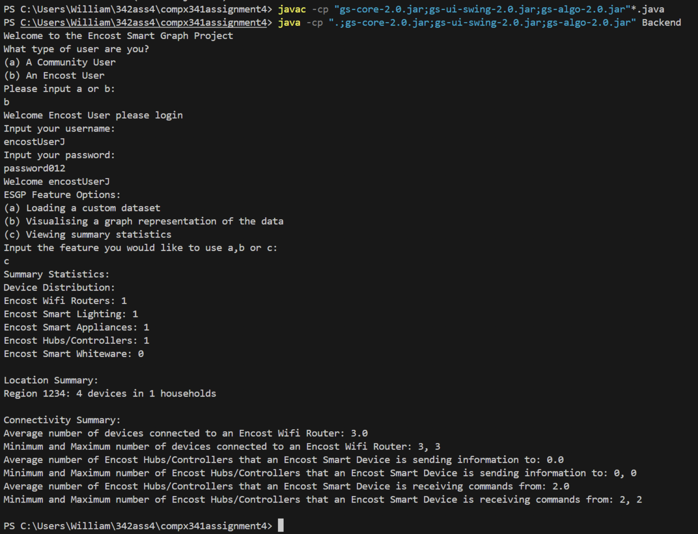

# Encost Smart Homes Data Analyzer

## Description

This is a command-line Java application designed to process, analyze, and display information from smart home device datasets. It provides different functionalities based on user type (community or verified Encost users). Verified users can load custom datasets and view more detailed information, while community users have limited access.

## Features

* **User Authentication**: Differentiates between "community" and "encost-verified" users.
    * Verified users log in with credentials stored in `users.txt`.
* **Dataset Loading**:
    * Loads smart home device data from a `.txt` file (CSV format).
    * Defaults to `Encost Smart Homes Dataset (small).txt`.
    * Verified users can specify a custom dataset file path.
* **Data Display (Planned/Partial)**:
    * Option to visualize a graph representation of the data (currently a placeholder).
    * Option to view summary statistics (connectivity, location, distribution - currently placeholders).

## Project Structure

* `Backend.java`: Main application logic, user interaction, and entry point.
* `Device.java`: Defines the data structure for a single smart home device.
* `DataSet.java`: Handles loading and managing the collection of device data.
* `Encost Smart Homes Dataset (small).txt`: Default sample data file.
* `users.txt`: Stores username and password credentials for verified users.

## Prerequisites

* Java Development Kit (JDK) version 8 or higher.

## How to Compile and Run

1.  **Ensure JDK is Installed**:
    Verify your JDK installation by running `java -version` and `javac -version` in your terminal/command prompt.

2.  **Download/Clone Files**:
    Place all the `.java` files and `.txt` data files into the same directory.

3.  **Open Terminal/Command Prompt**:
    Navigate to the directory where you saved the files.
    ```bash
    cd path/to/your/files
    ```

4.  **Compile the Java Code**:
    ```bash
    javac *.java
    ```
    This will generate `.class` files in the same directory.

5.  **Run the Application**:
    ```bash
    java Backend
    ```
    The program will start, and you will be prompted to select a user type.

## Usage

1.  When the program starts, you'll see:
    ```
    Please select user type:
    ```
    * Enter `a` for Community user access.
    * Enter `b` for Encost-verified user access.

2.  **If you choose 'b' (Encost-verified user):**
    * You will be prompted for your username and password.
    * Valid credentials can be found in `users.txt`. For example:
        * Username: `encostUserA`
        * Password: `password789`
    * Upon successful login, you will see options like:
        ```
        Select an option:
        a) Load a custom dataset
        b) Visualise a graph representation of the data
        c) View summary statistics
        ```

3.  **If you choose 'a' (Community user):**
    * You will see limited options:
        ```
        Select an option:
        a) Visualise a graph representation of the data
        ```

## Data File Formats

* **Dataset File (`.txt`)**:
    * Comma-separated values (CSV).
    * The first line must be a header.
    * Expected columns (see `Encost Smart Homes Dataset (small).txt` for an example):
        `Device ID,Date Connected,Device name,Device type,Household ID,Router Connection,Sends,Receives`
    * **Important Date Format**: The `Date Connected` column in the dataset file **must** use the format `dd/MM/yy` (e.g., `01/04/22`) for the program to parse it correctly as is. If your dataset uses a different format, you will need to modify the `SimpleDateFormat` in `Device.java`.

* **Users File (`users.txt`)**:
    * Comma-separated values (CSV).
    * Header: `Username,Password` (Note: current file has a typo "Passowrd")
    * Each subsequent line: `actualUsername,actualPassword`
 

## Screenshot

